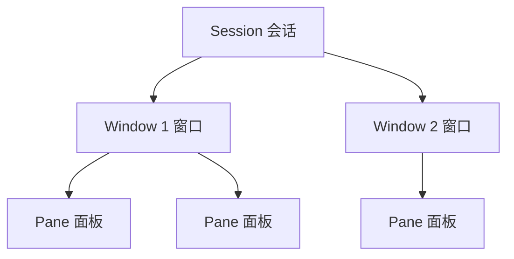

## 什么是 tmux

tmux（Terminal Multiplexer）是一个终端复用器，它允许你在单个终端窗口中创建、访问和控制多个终端会话。即使断开 SSH 连接，tmux 中的进程也会继续运行。

## 安装

:::tip
大多数 Linux 发行版的包管理器都可以直接安装 tmux。
:::

```bash
# Ubuntu / Debian
sudo apt install tmux

# macOS
brew install tmux

# Arch Linux
sudo pacman -S tmux
```

## 核心概念

tmux 有三个重要的层级概念：

- **Session（会话）**：最上层容器，可以包含多个窗口，断开后仍然存在
- **Window（窗口）**：类似浏览器标签页，一个会话可以有多个窗口
- **Pane（面板）**：窗口中的分屏区域，可以在一个窗口中同时查看多个终端



## 基本操作

### 会话管理

```bash
# 创建新会话
tmux new -s work

# 查看所有会话
tmux ls

# 分离当前会话（快捷键）
# 按 Ctrl+b 然后按 d

# 重新连接会话
tmux attach -t work

# 杀死会话
tmux kill-session -t work
```

### 快捷键前缀

tmux 的所有快捷键都以前缀键 `Ctrl+b` 开头。按下前缀键后再按对应的命令键。

### 窗口操作

| 快捷键 | 功能 |
|--------|------|
| `Ctrl+b` `c` | 创建新窗口 |
| `Ctrl+b` `n` | 切换到下一个窗口 |
| `Ctrl+b` `p` | 切换到上一个窗口 |
| `Ctrl+b` `0-9` | 切换到指定编号的窗口 |
| `Ctrl+b` `,` | 重命名当前窗口 |
| `Ctrl+b` `&` | 关闭当前窗口 |

### 面板操作

| 快捷键 | 功能 |
|--------|------|
| `Ctrl+b` `%` | 水平分割面板 |
| `Ctrl+b` `"` | 垂直分割面板 |
| `Ctrl+b` `方向键` | 在面板间切换 |
| `Ctrl+b` `x` | 关闭当前面板 |
| `Ctrl+b` `z` | 最大化/还原当前面板 |
| `Ctrl+b` `{` | 将面板向前移动 |
| `Ctrl+b` `}` | 将面板向后移动 |
| `Ctrl+b` `Space` | 切换面板布局 |

## 常用配置

在 `~/.tmux.conf` 中添加配置：

```bash
# 将前缀键改为 Ctrl+a（更符合习惯）
unbind C-b
set -g prefix C-a
bind C-a send-prefix

# 开启鼠标支持
set -g mouse on

# 设置状态栏
set -g status-style bg=colour235,fg=colour136
set -g status-left "#[fg=green]#S "
set -g status-right "#[fg=yellow]%Y-%m-%d #[fg=green]%H:%M"

# 使用 vi 风格的按键绑定
setw -g mode-keys vi

# 窗口编号从 1 开始
set -g base-index 1
setw -g pane-base-index 1

# 自动重新编号窗口
set -g renumber-windows on
```

> [!TIP]
> 修改配置后，在 tmux 中按 `Ctrl+b` 然后输入 `:source ~/.tmux.conf` 即可重新加载配置，无需重启。

## 实用技巧

### 复制模式

按 `Ctrl+b` `[` 进入复制模式，可以使用 vi 风格的按键浏览和复制文本：

- `q` 退出复制模式
- `Space` 开始选择
- `Enter` 复制选中内容
- `Ctrl+b` `]` 粘贴

### 发送命令到多个面板

```bash
# 同步输入到所有面板
:set synchronize-panes on

# 关闭同步输入
:set synchronize-panes off
```

### 会话脚本化

可以用脚本快速创建预设的工作环境：

```bash
#!/bin/bash
tmux new-session -d -s dev -n editor
tmux send-keys -t dev:editor 'nvim' Enter
tmux new-window -t dev -n server
tmux split-window -h -t dev:server
tmux send-keys -t dev:server.0 'npm run dev' Enter
tmux send-keys -t dev:server.1 'npm run test:watch' Enter
tmux attach -t dev
```

## 常用场景

### 远程服务器开发

tmux 最经典的使用场景就是在 SSH 连接远程服务器时。即使网络断开，tmux 会话中的进程也不会中断，重新连接后可以无缝恢复工作状态。

### 多任务并行

在一个终端窗口中同时监控日志、编辑代码、运行测试，通过面板分屏一目了然。

### 结对编程

tmux 支持多人同时连接同一个会话，适合远程结对编程和代码审查。

## 参考资源

- [tmux 官方文档](https://github.com/tmux/tmux/wiki)
- [tmux 速查表](https://tmuxcheatsheet.com/)
